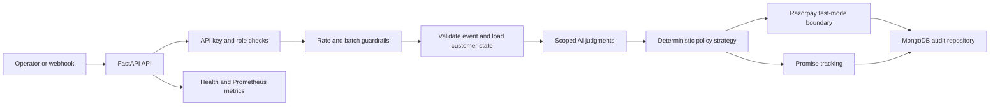

# Revenue Recovery Agent

Production-oriented recovery orchestration for payment, subscription, and mandate failures. The service combines deterministic financial policy with narrowly scoped AI judgment, Razorpay integrations, customer promises, durable audit records, and operational safeguards.

## Capabilities

- Classifies free-text payment failures with structured AI output and a provider-code fallback.
- Applies deterministic retry, nudge, switch-method, promise, close, and escalation policies.
- Enforces amount ceilings, retry ceilings, opt-out protection, batch exposure limits, and duplicate-event protection.
- Creates Razorpay test-mode payment links and validates provider responses before reporting success.
- Verifies Razorpay webhook signatures using the raw request body.
- Stores production audit records and customer state in MongoDB with unique and TTL indexes.
- Provides API-key authentication, read/admin roles, rate limiting, health probes, Prometheus metrics, and alert rules.
- Includes a Streamlit operator dashboard, synthetic data, baseline comparisons, CI, containerization, tests, SBOM, license, and vulnerability-report generation.

## Architecture



The design separates judgment from authorization. AI can classify a failure, generate copy, or classify a reply. It cannot choose a money-moving action, bypass a guardrail, or increase a retry ceiling.

## Operating Modes

### Demo mode

`RAZORPAY_DEMO_MODE=true` is the default. It runs without external credentials, uses clearly labeled simulated Razorpay outcomes, and uses local in-process state plus `audit_fallback.jsonl` for demonstration purposes.

### Production mode

Set `RAZORPAY_DEMO_MODE=false`. Production mode requires MongoDB, an API key, and a Razorpay webhook secret. It does not silently fall back to local persistence when MongoDB is unavailable. The service reports persistence failure and remains fail-closed.

## Quick Start

```powershell
py -3.11 -m venv .venv
.\.venv\Scripts\Activate.ps1
pip install -r requirements.txt
Copy-Item .env.example .env
```

Start the API:

```powershell
uvicorn api.main:app --reload
```

Start the dashboard in a second terminal:

```powershell
streamlit run app/dashboard.py
```

The API is available at `http://localhost:8000` and the interactive OpenAPI documentation is available at `/docs`.

## Configuration

Copy `.env.example` to `.env`. Never commit `.env` or place credentials in source control.

| Variable | Purpose |
| --- | --- |
| `RAZORPAY_DEMO_MODE` | `true` for simulation, `false` for production integration mode |
| `RAZORPAY_KEY_ID` | Razorpay test-mode key ID |
| `RAZORPAY_KEY_SECRET` | Razorpay test-mode secret |
| `RAZORPAY_WEBHOOK_SECRET` | Secret used to verify Razorpay webhook signatures |
| `RECOVERY_API_KEY` | API key required outside demo mode |
| `RECOVERY_API_ROLE` | `read` or `admin`; batch execution requires `admin` |
| `MONGODB_URI` | MongoDB connection string |
| `MONGODB_DATABASE` | MongoDB database name |
| `RATE_LIMIT_PER_MINUTE` | Per-key request limit |
| `ANTHROPIC_API_KEY` | Optional Claude access for AI judgment components |
| `LANGFUSE_PUBLIC_KEY` / `LANGFUSE_SECRET_KEY` | Optional AI observability credentials |

Use a managed secret store in deployment. Kubernetes secret injection is demonstrated in [deploy/kubernetes.yaml](deploy/kubernetes.yaml); do not place real values in the example manifests.

## API Surface

| Method | Endpoint | Access | Purpose |
| --- | --- | --- | --- |
| `GET` | `/health/live` | Public | Process liveness probe |
| `GET` | `/health/ready` | Public | Persistence readiness probe |
| `POST` | `/run-batch` | Admin | Process a bounded recovery batch |
| `GET` | `/audit-log` | Read | Review decision evidence |
| `GET` | `/metrics` | Read | Business and AI-cost metrics |
| `GET` | `/metrics/prometheus` | Internal | Prometheus scrape endpoint |
| `GET` | `/baseline-comparison` | Read | Compare policy and naive approaches |
| `POST` | `/run-promise-followups` | Admin | Reconcile promise-to-pay records |
| `POST` | `/classify-reply` | Read | Classify a customer reply |
| `POST` | `/webhooks/razorpay` | Signature | Accept verified Razorpay webhook events |

Production batch requests require an `X-API-Key` header and a unique `X-Idempotency-Key` header. Admin endpoints also require `X-API-Role: admin`.

Example:

```powershell
curl http://localhost:8000/metrics -H "X-API-Key: $env:RECOVERY_API_KEY"
```

## Policy and AI Boundaries

`graph/policy.py` implements a Strategy/Factory design. `PolicyContext` is the policy contract, `DeterministicPolicy` is the default fail-closed strategy, and `PolicyFactory.register()` supports new merchant or event policies without changing graph orchestration.

AI is used only where semantic language understanding adds value:

- Root-cause classification from provider text.
- Locale-aware recovery message generation.
- Reply-intent classification.
- Nudge quality and compliance judgment.

Retry counts, amount ceilings, cooldowns, channels, final actions, and compliance stops remain deterministic. Classification evaluation reports accuracy, match rate, macro precision, recall, F1, per-label metrics, and confidence buckets.

## Reliability and Security Controls

- MongoDB audit records use a unique `event_id` index and timestamp index.
- Idempotency keys and rate-limit records use TTL indexes.
- Duplicate webhook events are rejected using a unique provider event ID.
- Batch size and total exposure are checked before processing.
- Provider and processing failures return stable error codes rather than raw exception text.
- API keys are compared using constant-time comparison.
- Razorpay webhooks require HMAC-SHA256 verification.
- The container runs as a non-root user.
- Kubernetes readiness/liveness probes and TLS ingress configuration are included.
- Prometheus alert rules cover API availability, persistence availability, and processing-error rate.

## Testing and CI

Run the test suite:

```powershell
$env:PYTEST_DISABLE_PLUGIN_AUTOLOAD = "1"
python -m pytest -q
```

The suite covers policy decisions, guardrails, classification metrics, authentication, webhook signatures, health probes, and an end-to-end demo batch. GitHub Actions additionally runs Python compilation, `pip-audit`, license collection, dependency-report generation, and a Docker build.

## Dependency Evidence

Generate reports with:

```powershell
python scripts/generate_dependency_reports.py
```

Reports are stored under [reports](reports):

- `dependency-license-report.json`: licenses from installed metadata for the declared dependency closure.
- `dependency-vulnerability-report.json`: `pip-audit` result or an explicit unavailable-tool record.
- `dependency-sbom.json`: CycloneDX-format component inventory.

The repository currently has pinned direct requirements but no committed transitive lock file. The reports therefore identify their source and do not claim locked resolution. CI installs `pip-audit` and regenerates the evidence on every build.

## Deployment

The repository includes:

- [Dockerfile](Dockerfile) for a non-root production image.
- [deploy/kubernetes.yaml](deploy/kubernetes.yaml) for a two-replica API deployment, service, probes, secret injection, and TLS ingress.
- [deploy/prometheus.yml](deploy/prometheus.yml) for scraping.
- [deploy/alerts.yml](deploy/alerts.yml) for operational alerting.
- [deploy/tls-secret.example.yaml](deploy/tls-secret.example.yaml) as a secret-management placeholder.
- [.github/workflows/ci.yml](.github/workflows/ci.yml) for CI and container validation.

Before live traffic, configure a managed MongoDB deployment, TLS certificates, secret management, webhook registration, provider test-mode verification, log aggregation, alert routing, backup policy, and network controls.

## Project Structure

```text
api/main.py                         FastAPI service, auth, idempotency, webhooks, metrics
graph/policy.py                     Deterministic Strategy/Factory policy layer
graph/nodes.py                      Recovery workflow nodes and audit boundary
graph/guardrails.py                 Input, output, and batch safety controls
graph/ai_*.py                       Isolated AI judgment components
integrations/razorpay_client.py     Razorpay test-mode integration boundary
memory/mem0_client.py               Customer history and promise adapter
persistence/mongo.py                MongoDB repositories and indexes
eval/                               Baseline and AI-quality evaluation
tests/                              Unit, security, and end-to-end API tests
deploy/                             Kubernetes, TLS, Prometheus, and alerts
reports/                            Dependency license, vulnerability, and SBOM evidence
```

## Evaluation Snapshot

The included synthetic baseline compares the bounded policy engine with a deliberately unsafe fixed-retry baseline. In demo mode, the policy engine is designed to show recovery value while preventing unsafe retries, opt-out violations, and uncontrolled outreach. Treat these figures as reproducible demo evaluation, not production performance guarantees.

## License and Third-Party Software

The application uses open-source packages listed in [requirements.txt](requirements.txt), including FastAPI, Pydantic, LangGraph, Anthropic, Instructor, Langfuse, Mem0, PyMongo, Razorpay's Python SDK, Streamlit, Pandas, Uvicorn, and Pytest. Consult the generated license report and each package's license for complete attribution and compliance review.
